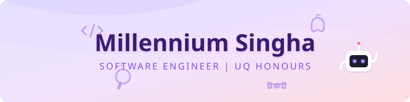

<div align="center">
  
</div>

<p align="center">
  
</p>

<p align="center">
  <a href="https://www.linkedin.com/in/millenniumsingha"></a>&nbsp;
  <a href="https://www.researchgate.net/profile/Millennium-Singha"></a>
</p>

---

```
🎓  Software Engineering Honours @ UQ  |  Diploma of Comp Sci @ Amity Uni India
📍  Queensland, Australia
⚡  Building things, breaking things, learning along the way.
```

<br>

## 🚀 Featured Projects

> *Curated picks that show what I have been building lately.*

<table>
  <tr>
    <td width="50%" valign="top">
      <h3 align="center">🛡️ tlscertwa</h3>
      <p align="center">
        <a href="https://github.com/millenniumsingha/tlscertwa">
          
        </a>
      </p>
      <p align="center">
        
        
      </p>
      <p align="center"><sub>Detects non-compliant TLS Certificates for IT/Security enterprise teams through distributed sensing amongst employees.</sub></p>
    </td>
    <td width="50%" valign="top">
      <h3 align="center">🧩 Campus Sensory Map</h3>
      <p align="center">
        <a href="https://github.com/millenniumsingha/campus_sensory_map">
          
        </a>
      </p>
      <p align="center">
        
        
      </p>
      <p align="center"><sub>A progressive web app letting neurodivergent and sensory-sensitive students at UQ contribute and view sensory condition ratings for campus spaces.</sub></p>
    </td>
  </tr>
  <tr>
    <td width="50%" valign="top">
      <h3 align="center">📱 Safelink</h3>
      <p align="center">
        <a href="https://github.com/millenniumsingha/Safelink">
          
        </a>
      </p>
      <p align="center">
        
        
      </p>
      <p align="center"><sub>Cross-platform emergency alert app built with Kotlin Multiplatform and Compose for Android, iOS, and Desktop. ⭐2</sub></p>
    </td>
    <td width="50%" valign="top">
      <h3 align="center">🏏 CricOptima</h3>
      <p align="center">
        <a href="https://github.com/millenniumsingha/CricOptima">
          
        </a>
      </p>
      <p align="center">
        
        
        
      </p>
      <p align="center"><sub>Fantasy cricket optimisation platform that builds winning teams using data science, gradient boosting, and linear programming. ⭐1</sub></p>
    </td>
  </tr>
</table>

<br>

---

## 🧰 Tech Stack

<details open>
<summary><b>👨‍💻 Languages</b></summary>
<br>
<p align="center">
  <a href="https://skillicons.dev">
    
  </a>
</p>
</details>

<details open>
<summary><b>⚙️ Frameworks & Platforms</b></summary>
<br>
<p align="center">
  <a href="https://skillicons.dev">
    
  </a>
</p>
<p align="center">
  
  
  
</p>
</details>

<details open>
<summary><b>🛠️ Tools & Technologies</b></summary>
<br>
<p align="center">
  <a href="https://skillicons.dev">
    
  </a>
</p>
</details>

<br>

---

## 📈 GitHub Analytics

<p align="center">
  
  &nbsp;
  
</p>

<p align="center">
  
</p>

<p align="center">
  
</p>

<br>

---

<details>
<summary><b>🏆 Achievements & Recognition</b></summary>
<br>

<table align="center">
  <tr>
    <td align="center">
      
      <br><b>Dell Campassador</b>
      <br><sub>Runner-Up</sub>
    </td>
    <td align="center">
      
      <br><b>UMEED (NGO)</b>
      <br><sub>Letter of Recommendation</sub>
    </td>
  </tr>
</table>
</details>

<details>
<summary><b>📄 Research & Publications</b></summary>
<br>

<p align="center">
  <a href="https://www.researchgate.net/publication/332762115_A_Deep_Dissertion_of_Data_Science_Related_Issues_and_its_Applications">
    
  </a>
</p>

**"A Deep Dissertation of Data Science: Related Issues & Its Applications"**  
<sub>Published in IEEE. Exploring challenges and real-world applications in data science.</sub>

</details>

<details>
<summary><b>🗂️ Other Projects</b></summary>
<br>

| Project | Tech | Description |
|---------|------|-------------|
| [dotnet-learning-lab](https://github.com/millenniumsingha/dotnet-learning-lab) | C#, .NET 10, WPF | Hands-on .NET 10 learning lab with playable demos ⭐1 |
| [StyleNet](https://github.com/millenniumsingha/StyleNet) | Jupyter, CNN | Fashion MNIST image classification (~92% accuracy) |
| [millennium_java_suite](https://github.com/millenniumsingha/millennium_java_suite) | Java, Swing | Showcase of Java mini-applications with GUI |
| [NEWS_APP_ANDROID](https://github.com/millenniumsingha/NEWS_APP_ANDROID) | Java, Android | Android application for browsing news articles |

</details>

<br>

---

<p align="center">
  
</p>
